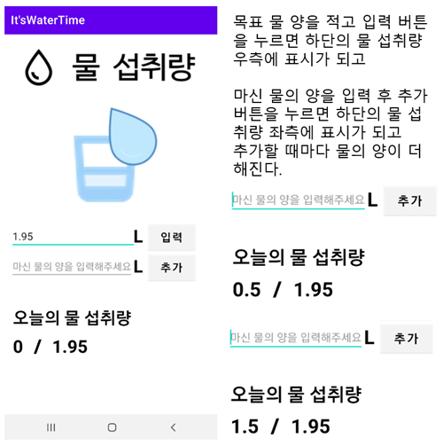

# WaterTime
2021년 모바일프로그래밍 - 하루물섭취량 애플리케이션

 
 

## 📑 프로젝트 개요
몇 년 전부터 하루에 반드시 먹어야 하는 물의 양은 2L이다, 종이컵 기준으로 8잔이다. 라는 말과 함께 물 마시기 운동이 크게 화제가 되었다.  
하지만 정작 사람마다 키와 몸무게가 달라 자신이 얼마만큼 물을 마셔야 하는지 모르는 경우가 더 많아 부작용을 겪은 사람들이 늘어났다.  
물을 먹어야 하는 이유는 크게 4가지이다.
물은 우리 몸에 70%에 있는 영양소로, 섭취한 영양성분을 체액에 녹여 세포로 운반하며, 몸에 필요 없는 노폐물을 세포에서 빼어 다양한 경로로 배출한다.  
또한 체온을 조절해주며 세포의 삼투압을 유지시켜주는 중요한 역할을 한다.  
하지만 물을 너무 많이 마시게 되면 수독증에 걸리게 된다.  
수독은 진액에 되지 못한 불필요한 체액이다. 진액은 음식이 소화되어 장부의 작용에 의해 생기는 영양 물질인데, 이렇게 진액이 되지 못한 수분 찌꺼기가 배출	 지 못하고, 몸속에 남아 있는 상태가 수독증이다.  
이처럼 몸에 물의 양이 부족해도, 너무 많아도 건강이 위험해진다.  
사람마다 다른 물의 양을 알려주고, 물을 마셔야 하는 시간마다 알림을 해줌으로써, 조금 더 건강한 삶의 사이클을 유지할 수 있었으면 좋겠다는 마음으로 개발하	 게 되었다.
 

## 📋 시스템 흐름도

 

## 💻 프로젝트 구현

### [ 초기 화면 ]

### [ 물 섭취량 ]

### [ 설정 ]

